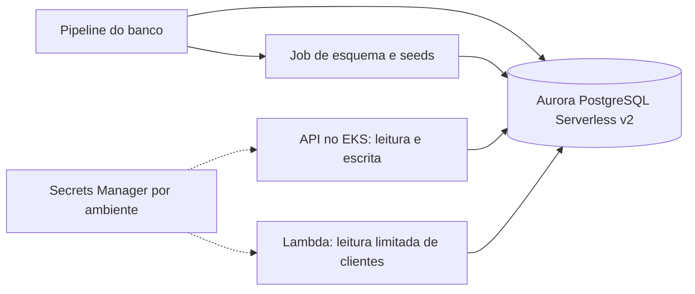

# Banco do Sistema de Gerenciamento de Mecânica

Mantém o esquema SQL, os dados de demonstração e a futura infraestrutura/inicialização do banco compartilhado pela API e pela função de autenticação.

## Estado da implementação

O esquema da Fase 2 está em [sql/Init.sql](sql/Init.sql), transferido sem alteração funcional. O script cria tabelas e seeds em **banco vazio**; não é idempotente nem uma migração incremental.

Aurora PostgreSQL Serverless v2, Terraform do banco, credencial de leitura da função, Job de inicialização e histórico de status ainda serão implementados. O SQL atual não contém status Ativo/Inativo de clientes nem `order_status_history`; as datas antigas de OS ainda fazem parte dele.

## Estrutura e tecnologias

| Caminho | Conteúdo |
|---|---|
| [sql/Init.sql](sql/Init.sql) | Esquema e seeds PostgreSQL |
| [legacy/kubernetes](legacy/kubernetes) | Quatro manifestos históricos de PostgreSQL/EBS da Fase 2 |
| [origem-fase2.json](docs/origem-fase2.json) | Proveniência e hashes dos cinco arquivos transferidos |

As tabelas atuais são `users`, `customers`, `vehicles`, `orders`, `stock`, `catalog`, `order_materials` e `order_services`. O ambiente local da aplicação usa PostgreSQL 16. Os manifests legados estão arquivados e não participam do Kustomize ativo da aplicação.

## Integração alvo



O diagrama é a arquitetura planejada. Atualmente existe o SQL; a infraestrutura e a automação representadas ainda não foram criadas neste repositório.

## Execução local opcional

O uso principal será a API na AWS. Para usar Docker localmente:

1. Clone este repositório e o da [aplicação](https://github.com/pknfelps/GerenciamentoMecanicaSistema/tree/develop). Configure o `.env` da aplicação.
2. Na raiz da aplicação, execute `docker compose up -d db smtp`.
3. Com um cliente PostgreSQL, conecte ao banco vazio usando host/porta, usuário, senha e database definidos no `.env`.
4. Execute manualmente [sql/Init.sql](sql/Init.sql) e então inicie a API, conforme o README da aplicação.

Com `psql` instalado, este exemplo é executado **na raiz deste repositório**, para os valores padrão de host, porta, usuário e database do Compose:

```bash
psql --host=localhost --port=5432 --username=postgres --dbname=postgres --password --set=ON_ERROR_STOP=on --single-transaction --file=sql/Init.sql
```

A senha é solicitada pelo cliente; ajuste os argumentos se alterou o `.env`. O comando cria tabelas e dados, portanto use apenas o banco local vazio escolhido. `ON_ERROR_STOP` e a transação impedem continuar com uma inicialização parcial se houver erro. Para conferir as tabelas:

```bash
psql --host=localhost --port=5432 --username=postgres --dbname=postgres --password --command="\dt public.*"
```

O script cria o usuário educacional `Admin`/`Admin@123`, com senha em hash e role Admin, além de cliente, veículo, serviço e material. Não há OS inicial. Esses registros são destinados à demonstração.

A API não armazena cópia do SQL, não executa init automático e não sincroniza scripts. Para reutilizar um banco existente, avalie seu estado antes de executar o SQL; não reaplique o script em todo startup.

## Validação, CI e deploy

Ainda não existem testes automatizados, workflow ou Terraform neste repositório. A validação manual do esquema consiste em aplicar o script a um PostgreSQL vazio, conferir as oito tabelas/seeds e exercitar os fluxos da API. Os testes de persistência da aplicação preparam suas próprias tabelas; não comprovam sozinhos a execução deste script completo.

Na AWS, a entrega planejada provisionará Aurora e executará um Job de esquema/seeds antes da API/função. Estados, credenciais e referências serão separados por ambiente. O banco educacional será recriado quando necessário; não há migração/backfill de dados nesta fase. A inicialização não será executada a cada início de pod.

O modelo de histórico/status, seus índices e o diagrama ER definitivo serão documentados junto da implementação. Consulte a [RFC de dados](https://github.com/pknfelps/GerenciamentoMecanicaSistema/blob/develop/docs/arquitetura/rfcs/003-DADOS-E-OBSERVABILIDADE.md) e a [RFC de entrega](https://github.com/pknfelps/GerenciamentoMecanicaSistema/blob/develop/docs/arquitetura/rfcs/002-ENTREGA.md).

## Desenvolvimento e ambientes

Crie branches a partir da `develop` atualizada e abra PRs para `develop`. Promova `develop -> main` ao concluir a entrega. **hom** e **prd** terão bancos, segredos e estados próprios, permitindo coexistência; essa infraestrutura ainda não está implementada.

## APIs e referências

O banco não expõe API HTTP. A API da oficina usa leitura/escrita; a função consultará apenas os dados necessários para validar clientes.

- [Aplicação e execução local](https://github.com/pknfelps/GerenciamentoMecanicaSistema/tree/develop).
- [Contrato de autenticação e permissões](https://github.com/pknfelps/GerenciamentoMecanicaSistema/blob/develop/docs/arquitetura/ACESSO_E_AUTENTICACAO.md).
- [Infraestrutura](https://github.com/pknfelps/GerenciamentoMecanicaInfraestrutura/tree/develop).
- [Autenticação](https://github.com/pknfelps/GerenciamentoMecanicaAutenticacao/tree/develop).
