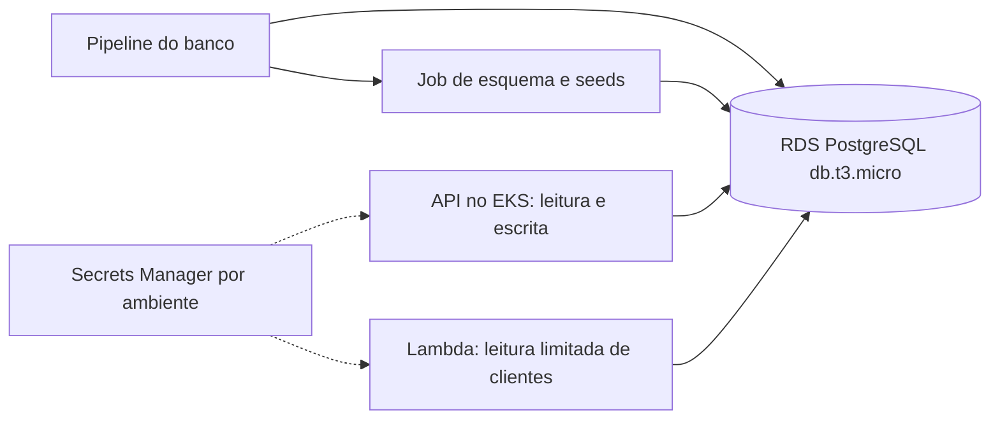

# Banco do Sistema de Gerenciamento de Mecânica

Mantém o esquema SQL, os dados de demonstração e a futura infraestrutura/inicialização do banco compartilhado pela API e pela função de autenticação.

## Estado da implementação

O esquema da Fase 2 está em [sql/Init.sql](sql/Init.sql), transferido sem alteração funcional. O script cria tabelas e seeds em **banco vazio**; não é idempotente nem uma migração incremental.

O Terraform da instância RDS PostgreSQL `db.t3.micro` está em [terraform](terraform), com o escopo e as pendências em [docs/RDS_TERRAFORM.md](docs/RDS_TERRAFORM.md). O bootstrap IAM e os workflows de provisionamento/descarte ainda usam Aurora e precisam ser adaptados antes de qualquer novo deploy. Credenciais de aplicação/função, Job de inicialização e histórico de status ainda serão implementados. O SQL atual não contém status Ativo/Inativo de clientes nem `order_status_history`; as datas antigas de OS ainda fazem parte dele.

## Estrutura e tecnologias

| Caminho | Conteúdo |
|---|---|
| [sql/Init.sql](sql/Init.sql) | Esquema e seeds PostgreSQL |
| [legacy/kubernetes](legacy/kubernetes) | Quatro manifestos históricos de PostgreSQL/EBS da Fase 2 |
| [origem-fase2.json](docs/origem-fase2.json) | Proveniência e hashes dos cinco arquivos transferidos |

As tabelas atuais são `users`, `customers`, `vehicles`, `orders`, `stock`, `catalog`, `order_materials` e `order_services`. O ambiente local da aplicação usa PostgreSQL 16. Os manifests legados estão arquivados e não participam do Kustomize ativo da aplicação.

## Integração alvo


```mermaid
flowchart LR
    PIPE["Pipeline do banco"] --> RDS[("RDS PostgreSQL db.t3.micro")]
    PIPE --> JOB["Job de esquema e seeds"]
    JOB --> RDS
    API["API no EKS: leitura e escrita"] --> RDS
    AUTH["Lambda: leitura limitada de clientes"] --> RDS
    SECRETS["Secrets Manager por ambiente"] -.-> API
    SECRETS -.-> AUTH
```

A instância e a rede estão definidas no Terraform; Job, usuários de aplicação e automação RDS do deploy ainda estão planejados.

## Execução local opcional

O uso principal será a API na AWS. Para usar Docker localmente:

1. Clone este repositório e o da [aplicação](https://github.com/pknfelps/GerenciamentoMecanicaSistema/tree/develop). Configure o `.env` da aplicação.
2. Na raiz da aplicação, execute `docker compose up -d db smtp`.
3. Com um cliente PostgreSQL, conecte ao banco vazio usando host/porta, usuário, senha e database definidos no `.env`.
4. Execute manualmente [sql/Init.sql](sql/Init.sql) e então inicie a API, conforme o README da aplicação.

Com `psql` instalado, este exemplo é executado **na raiz deste repositório**, para os valores padrão de host, porta, usuário e database do Compose:

```bash
psql --host=localhost --port=5432 --username=postgres --dbname=postgres --password --set=ON_ERROR_STOP=on --single-transaction --file=sql/Init.sql
```

A senha é solicitada pelo cliente; ajuste os argumentos se alterou o `.env`. O comando cria tabelas e dados, portanto use apenas o banco local vazio escolhido. `ON_ERROR_STOP` e a transação impedem continuar com uma inicialização parcial se houver erro. Para conferir as tabelas:

```bash
psql --host=localhost --port=5432 --username=postgres --dbname=postgres --password --command="\dt public.*"
```

O script cria o usuário educacional `Admin`/`Admin@123`, com senha em hash e role Admin, além de cliente, veículo, serviço e material. Não há OS inicial. Esses registros são destinados à demonstração.

A API não armazena cópia do SQL, não executa init automático e não sincroniza scripts. Para reutilizar um banco existente, avalie seu estado antes de executar o SQL; não reaplique o script em todo startup.

## Validação, CI e deploy

O [workflow de CI](.github/workflows/ci.yml) executa o job `database-validate` em PRs e pushes para `develop`/`main` e por acionamento manual, sem filtro por caminhos. Ele inicia um PostgreSQL 16 descartável no runner, aplica `sql/Init.sql` com interrupção em erro/transação única e executa [tests/smoke.sql](tests/smoke.sql).

O teste verifica o administrador com hash, os seeds relacionados, a criação de OS com material/serviço, a rejeição de item órfão e a unicidade do documento de cliente. As escritas de teste terminam em rollback. Falha SQL ou de asserção encerra o job com erro. A senha presente no workflow serve exclusivamente ao banco temporário do CI; não é uma credencial AWS ou de ambiente da aplicação.

Para repetir o teste manualmente, após preparar um PostgreSQL descartável com `sql/Init.sql`, execute na raiz deste repositório (ajustando a conexão):

```bash
psql --host=localhost --port=5432 --username=postgres --dbname=postgres --password --no-psqlrc --set=ON_ERROR_STOP=on --file=tests/smoke.sql
```

Após publicar o workflow e confirmar a primeira execução, configurar `database-validate` como check obrigatório no ruleset. Não há acesso ao banco da aplicação ou à AWS nesse CI; o teste Terraform usa provider simulado. Deploy do RDS depende da adaptação de IAM e workflows. Os testes de persistência da aplicação continuam preparando suas próprias tabelas e não substituem a execução do SQL completo aqui.

Na AWS, a entrega planejada provisionará RDS PostgreSQL e executará um Job de esquema/seeds antes da API/função. Estados, credenciais e referências serão separados por ambiente. O banco educacional será recriado quando necessário; não há migração/backfill de dados nesta fase. A inicialização não será executada a cada início de pod.

O modelo de histórico/status, seus índices e o diagrama ER definitivo serão documentados junto da implementação. Consulte a [RFC de dados](https://github.com/pknfelps/GerenciamentoMecanicaSistema/blob/develop/docs/arquitetura/rfcs/003-DADOS-E-OBSERVABILIDADE.md) e a [RFC de entrega](https://github.com/pknfelps/GerenciamentoMecanicaSistema/blob/develop/docs/arquitetura/rfcs/002-ENTREGA.md).

## Contratos de integração

A [especificação central](https://github.com/pknfelps/GerenciamentoMecanicaSistema/blob/develop/docs/arquitetura/CONTRATOS_ENTRE_REPOSITORIOS.md) detalha a interface do produtor **database**. A instância RDS está definida em Terraform; publicadores SSM e Job ainda serão implementados. O SQL legado não comprova o contrato alvo de status/histórico nem possui uma versão formal de esquema publicada.

| Interface | Responsabilidade do banco |
|---|---|
| Consome da base | VPC, subnets privadas de banco, cluster/namespace e SGs efetivos de API, função e Job |
| Provisiona | RDS PostgreSQL e credenciais separadas: administrativa para o Job, leitura/escrita para API e leitura limitada de clientes para a função |
| Publica em SSM | /mecanica/<ambiente>/database/v1/: instance-arn, endpoint, port, database-name, security-group-id, ssl-mode, três secret-arns, schema-version, schema-sha256, initialized-at, release e tentativas |
| Entrega aos consumidores | Endpoint/porta/database, TLS VerifyFull, referência da credencial específica e identidade/compatibilidade do SQL aplicado |
| Mantém no repositório | SQL, seeds, testes e definição da versão do esquema; não depende de artefatos SQL no bucket compartilhado |

O SHA-256 corresponde aos bytes de sql/Init.sql enquanto houver um único script. Ao dividir o esquema, o bundle terá ordem explícita e hash próprio. A primeira versão formal será registrada junto da implementação. API/função declaram compatibilidade com essa versão e não reaplicam o SQL.

Ready significa RDS acessível, esquema/seeds inicializados, credenciais/permissões verificadas e testes SQL aprovados. Falha do Job impede publicação de release pronta. Se o banco não estiver vazio, não executar o script de inicialização como migração; recriação educacional é uma operação explícita.

O [diagnóstico manual OIDC](.github/workflows/aws-oidc-check.yml) testa a role database por ambiente. Entradas: AWS_REGION, AWS_ROLE_ARN e TF_STATE_BUCKET. O bootstrap ainda concede à role do banco permissões orientadas ao Aurora; a revisão para RDS e Secret gerenciado é a próxima etapa. As permissões do futuro Job e dos consumidores ainda precisam ser configuradas. Descarte deste componente não remove bootstrap, base ou banco do outro ambiente.

## Desenvolvimento e ambientes

Crie branches a partir da `develop` atualizada e abra PRs para `develop`. Promova `develop -> main` ao concluir a entrega. **hom** e **prd** têm configuração e estados próprios no Terraform, permitindo coexistência quando provisionados.

## APIs e referências

O banco não expõe API HTTP. A API da oficina usa leitura/escrita; a função consultará apenas os dados necessários para validar clientes.

- [Aplicação e execução local](https://github.com/pknfelps/GerenciamentoMecanicaSistema/tree/develop).
- [Contrato de autenticação e permissões](https://github.com/pknfelps/GerenciamentoMecanicaSistema/blob/develop/docs/arquitetura/ACESSO_E_AUTENTICACAO.md).
- [Infraestrutura](https://github.com/pknfelps/GerenciamentoMecanicaInfraestrutura/tree/develop).
- [Autenticação](https://github.com/pknfelps/GerenciamentoMecanicaAutenticacao/tree/develop).


### Gatilhos de CI

O CI automático valida PRs destinados a develop/main, sem uma segunda execução por push. Novos commits cancelam os checks antigos do mesmo PR; execução manual continua disponível. Os nomes dos jobs/checks foram preservados.

## Evidência de acesso para a base — E2.14

O workflow manual aws-oidc-check, com check_kubernetes=true, agora executa scripts/record_base_access.py. Após autenticar com a role database, confere Jobs, pods/logs e service accounts no namespace default. Se a infraestrutura publicou /mecanica/<ambiente>/base/v1/database-candidate, o script relê o candidato e registra /mecanica/<ambiente>/database/v1/base-access-check (geração, hash, identidade, run e horário). Sem candidato, mantém o diagnóstico e informa que não houve registro SSM.

Executar sequencialmente: ativação da base -> check do banco -> nova ativação completa da base. A evidência vale por até 24 horas e só corresponde à mesma geração/recursos/configuração de acesso. Ela não é release do banco e não provisiona RDS/esquema. Não executar junto de provisionamento ou destroy da base no mesmo ambiente. Procedimento: [Metadados da base](https://github.com/pknfelps/GerenciamentoMecanicaInfraestrutura/blob/develop/docs/METADADOS_BASE.md).

Teste local sem AWS: python -m unittest discover -s tests -p 'test_*.py' -v. A comprovação no runner continua pendente.

## Consumo de database-release — E2.2

O [consumidor](scripts/consume_database_release.py) lê exclusivamente
`/mecanica/<hom|prd>/base/v1/database-release`, valida o perfil `database` ready
e confere rede/EKS/SGs e acesso Kubernetes com a role do banco. O
[workflow manual database-base-check](.github/workflows/database-base-check.yml)
executa captura e releitura. Não provisiona RDS nem publica release do banco.

Instalação das permissões de consulta, comandos, formato do snapshot e limites:
[Consumo da base](docs/CONSUMO_BASE.md).
